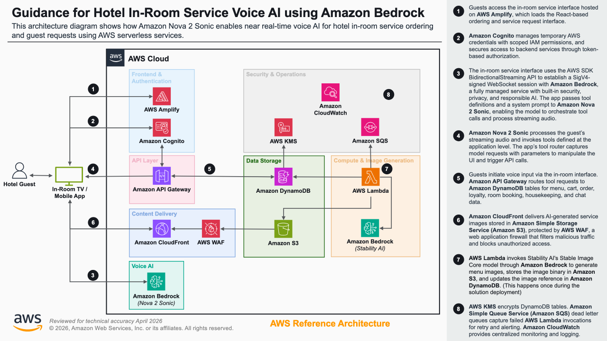

# Guidance for Hotel In-Room Service Voice AI using Amazon Bedrock

> **Note:** This README provides both an automated deployment option and equivalent manual steps. The underlying infrastructure and application are the same regardless of which method you choose.

## Table of Contents

1. [Overview](#overview)
    - [Cost](#cost)
2. [Prerequisites](#prerequisites)
    - [Operating System](#operating-system)
    - [AWS Account Requirements](#aws-account-requirements)
    - [Supported Regions](#supported-regions)
3. [Manual Deployment](#manual-deployment)
4. [Deployment Validation](#deployment-validation)
5. [Running the Guidance](#running-the-guidance)
6. [Next Steps](#next-steps)
7. [Cleanup](#cleanup)
8. [FAQ, Known Issues, Additional Considerations, and Limitations](#faq-known-issues-additional-considerations-and-limitations)
9. [Notices](#notices)
10. [Authors](#authors)

## Overview

This Guidance demonstrates how to build an intelligent hotel in-room service system using **Amazon Nova 2 Sonic** and AWS serverless services. The system combines near real-time voice AI with an interactive digital service interface to deliver natural, human-like guest interactions that address common hospitality challenges including staffing constraints during peak hours, language barriers, order accuracy issues, and inconsistent service quality across shifts.

**Amazon Nova 2 Sonic** is a foundation model (FM) within the **Amazon Nova** family, available through **Amazon Bedrock**, a fully managed service with built-in security, privacy, and responsible AI. It processes streaming speech with robustness to background noise, adapts responses to user tone and sentiment, and supports bidirectional streaming with low perceived latency. The system establishes a SigV4-signed WebSocket session from the browser to Amazon Bedrock using the AWS SDK BidirectionalStreaming API (`client-bedrock-runtime` v3.842.0), eliminating the need for a backend relay server.

The architecture integrates the following AWS services:

- **Amazon Cognito** — Manages temporary AWS credentials with scoped IAM permissions and secures access to backend services through token-based authorization
- **AWS Amplify** — Hosts the React-based in-room service interface
- **Amazon API Gateway** — REST API with Cognito authorization and direct **Amazon DynamoDB** integration
- **Amazon DynamoDB** — Stores menu items, loyalty data, cart sessions, orders, chat history, room bookings, and housekeeping requests across seven tables
- **AWS Lambda** — Populates menu data and generates AI images by invoking **Stability AI Stable Image Core** model through Amazon Bedrock
- **Amazon Simple Storage Service (Amazon S3)** — Stores AI-generated service item images
- **Amazon CloudFront** — Global content delivery for service images with **AWS WAF** protection
- **AWS WAF** — Web application firewall that filters malicious traffic and blocks unauthorized access to CloudFront
- **AWS Key Management Service (AWS KMS)** — Encrypts DynamoDB tables and Lambda environment variables
- **Amazon Simple Queue Service (Amazon SQS)** — Dead letter queues that capture failed Lambda invocations for retry and alerting
- **Amazon CloudWatch** — Centralized monitoring and logging
- **AWS Identity and Access Management (IAM)** — Least-privilege roles for all service interactions

The following architecture diagram illustrates how these services interconnect to enable natural conversations between guests and the in-room service interface, orchestrating the entire guest journey from service request to order completion.



1. Guests access the in-room service interface hosted on **AWS Amplify**, which loads the React-based ordering and service request interface.
2. **Amazon Cognito** manages temporary AWS credentials with scoped IAM permissions and secures access to backend services through token-based authorization.
3. The in-room service interface uses the AWS SDK BidirectionalStreaming API to establish a SigV4-signed WebSocket session with **Amazon Bedrock**. The app passes tool definitions and a system prompt to **Amazon Nova 2 Sonic**, enabling the model to orchestrate tool calls and process streaming audio.
4. **Amazon Nova 2 Sonic** processes the guest's streaming audio and invokes tools defined at the application level. The app's tool router captures model requests with parameters to manipulate the UI and trigger API calls.
5. Guests initiate voice input via the in-room interface. **Amazon API Gateway** routes tool requests to **Amazon DynamoDB** tables for menu, cart, order, loyalty, room booking, housekeeping, and chat data.
6. **Amazon CloudFront** delivers AI-generated service images stored in **Amazon S3**, protected by **AWS WAF**, a web application firewall that filters malicious traffic and blocks unauthorized access.
7. **AWS Lambda** invokes Stability AI's Stable Image Core model through **Amazon Bedrock** to generate service item images, stores the image binary in **Amazon S3**, and updates the image reference in **Amazon DynamoDB**. This happens once during the Guidance deployment.
8. **AWS KMS** encrypts DynamoDB tables. **Amazon SQS** dead letter queues capture failed **AWS Lambda** invocations for retry and alerting. **Amazon CloudWatch** provides centralized monitoring and logging.

### Cost

You are responsible for the cost of the AWS services used while running this Guidance. As of April 2026, the cost for running this Guidance with the default settings in the US East (N. Virginia) Region is approximately **$135.00 per month** for processing approximately 10,000 guest service interactions.

The following table provides a sample cost breakdown for deploying this Guidance with the default parameters in the US East (N. Virginia) Region for one month.

| AWS Service | Dimensions | Cost [USD] |
| --- | --- | --- |
| Amazon Cognito | 1,000 active users per month (no advanced security) | $0.00 |
| Amazon API Gateway | 50,000 REST API calls per month | $0.18 |
| Amazon DynamoDB | 7 tables, on-demand capacity, 10 GB storage, 50,000 read/write units | $7.50 |
| AWS Lambda | 10,000 invocations, 1024 MB memory, 30s avg duration (menu population) | $5.01 |
| Amazon S3 | 1 GB storage, 50,000 GET requests | $0.03 |
| Amazon CloudFront | 50 GB data transfer, 100,000 requests | $5.85 |
| AWS WAF | 1 Web ACL, 3 rules, 100,000 requests | $7.00 |
| Amazon Bedrock — Nova 2 Sonic | 10,000 voice sessions, ~30s avg (input + output audio) | $83.00 |
| Amazon Bedrock — Image Generation | 40 images generated during initial deployment | $4.00 |
| AWS KMS | 1 customer-managed key, 50,000 requests | $1.03 |
| Amazon SQS | 1,000 messages (dead letter queue) | $0.00 |
| AWS Amplify Hosting | 1 app, 15 GB served | $18.90 |
| Amazon CloudWatch | Basic monitoring + 2 GB logs | $1.00 |
| **Total estimated cost** | | **~$133.50/month** |

We recommend creating a [Budget](https://docs.aws.amazon.com/cost-management/latest/userguide/budgets-managing-costs.html) through [AWS Cost Explorer](https://aws.amazon.com/aws-cost-management/aws-cost-explorer/) to help manage costs. Prices are subject to change. For full details, refer to the pricing webpage for each AWS service used in this Guidance.

## Prerequisites

### Operating System

These deployment instructions are optimized to best work on **Amazon Linux 2023**. Deployment on macOS, Windows, or other Linux distributions may require additional steps.

- [AWS CLI](https://docs.aws.amazon.com/cli/latest/userguide/getting-started-install.html) v2.x — configured with appropriate credentials
- [AWS account](https://signin.aws.amazon.com/signin) with administrator access or sufficient permissions to create the resources listed in this Guidance

### AWS Account Requirements

Before deploying this Guidance, verify the following:

1. **Amazon Bedrock model access** — Enable access to the following foundation models in the Amazon Bedrock console in the same Region where you deploy this Guidance:
   - Amazon Nova 2 Sonic (`amazon.nova-2-sonic-v1:0`)
   - Stability AI Stable Image Core (`stability.stable-image-core-v1:1`)

2. **Service quotas** — Verify your account has sufficient quotas for:
   - AWS Lambda concurrent executions (default: 1,000)
   - Amazon DynamoDB tables (default: 2,500)
   - Amazon CloudFront distributions (default: 200)

3. **AWS WAF** — The deployment creates a WAF Web ACL with `CLOUDFRONT` scope. This requires the CloudFormation stack to be deployed in `us-east-1` or in a Region that supports CloudFront-scoped WAF resources.

### Supported Regions

Deploy this Guidance in an AWS Region where Amazon Bedrock supports both Amazon Nova 2 Sonic and the Stability AI image generation model. As of April 2026, supported Regions include:

- US East (N. Virginia) — `us-east-1`
- US West (Oregon) — `us-west-2`

Verify current Region availability in the [Amazon Bedrock supported Regions documentation](https://docs.aws.amazon.com/bedrock/latest/userguide/models-regions.html).

## Manual Deployment

### Step 1: Clone the repository

```bash
git clone https://github.com/aws-samples/sample-voice-ai-powered-in-room-service-with-amazon-nova-sonic.git
cd sample-voice-ai-powered-in-room-service-with-amazon-nova-sonic
```

### Step 2: Deploy the infrastructure stack

1. Open the [AWS CloudFormation console](https://console.aws.amazon.com/cloudformation/).
2. Choose **Create stack** > **With new resources (standard)**.
3. Under **Specify template**, choose **Upload a template file** and upload `nova-sonic-infrastructure-hotel-InRoomService.yaml`.
4. Choose **Next** and provide the following parameters:
   - **Stack name** — Enter a name (e.g., `nova-sonic-hotel-infra-dev`)
   - **Environment** — Select `dev`, `staging`, or `prod` (default: `dev`)
   - **UserEmail** — Enter a valid email address to receive the initial login credentials
5. Choose **Next**, acknowledge the IAM capabilities checkbox, and choose **Submit**.
6. Wait for the stack status to reach `CREATE_COMPLETE` (approximately 5–10 minutes).

### Step 3: Record infrastructure outputs

1. In the CloudFormation console, select the infrastructure stack.
2. Choose the **Outputs** tab.
3. Copy and save the following values — you need them to configure the frontend application:
   - `UserPoolId`
   - `UserPoolClientId`
   - `IdentityPoolId`
   - `menuApiUrl`
   - `cartApiUrl`
   - `orderApiUrl`
   - `loyaltyApiUrl`
   - `chatApiUrl`
   - `housekeepingApiUrl`
   - `roomBookingApiUrl`

### Step 4: Deploy the application stack

1. In the CloudFormation console, choose **Create stack** > **With new resources (standard)**.
2. Upload `nova-sonic-application-hotel-InRoomService.yaml`.
3. Provide the following parameter:
   - **Stack name** — Enter a name (e.g., `nova-sonic-hotel-app-dev`)
   - **InfrastructureStackName** — Enter the exact stack name from Step 2 (e.g., `nova-sonic-hotel-infra-dev`)
4. Choose **Next**, acknowledge the IAM capabilities checkbox, and choose **Submit**.
5. Wait for the stack status to reach `CREATE_COMPLETE` (approximately 10–15 minutes). This stack generates AI images for all service items using Amazon Bedrock.

### Step 5: Deploy the Amplify frontend

1. Download the frontend code `deploy/frontend-hotel-inroom-service.zip` from the [GitHub repository](https://github.com/aws-samples/sample-voice-ai-powered-in-room-service-with-amazon-nova-sonic).
2. Open the [AWS Amplify console](https://console.aws.amazon.com/amplify/).
3. Choose **Create new app** > **Deploy without Git provider**.
4. Upload the `frontend-hotel-inroom-service.zip` file and choose **Save and deploy**.
5. Wait for the deployment to complete and note the generated application URL.

## Deployment Validation

1. Open the [AWS CloudFormation console](https://console.aws.amazon.com/cloudformation/) and verify both stacks show status `CREATE_COMPLETE`:
   - Infrastructure stack (e.g., `nova-sonic-hotel-infra-dev`)
   - Application stack (e.g., `nova-sonic-hotel-app-dev`)

2. Verify DynamoDB tables are populated:

   ```bash
   aws dynamodb scan --table-name <MenuTableName> --select COUNT
   ```

   Expected output: approximately 40+ menu items including breakfast, lunch, dinner, beverages, housekeeping, spa, and amenity items.

3. Verify AI-generated images exist in S3:

   ```bash
   aws s3 ls s3://<MenuImagesBucketName>/ --recursive | wc -l
   ```

   Expected output: approximately 40 image files across category folders.

4. Open the Amplify application URL in a browser and verify the sign-in page loads.

## Running the Guidance

### Step 1: Configure the application

1. Open the Amplify application URL in your browser.
2. Select **Choose Sample**, then pick **AI Hotel In-Room Service** from the sample list, and select **Load Sample**. This imports the system prompt, tools, and tool configurations.
3. Enter the Amazon Cognito configuration values from the CloudFormation outputs:
   - `UserPoolId`
   - `UserPoolClientId`
   - `IdentityPoolId`
4. Enter the API endpoint URLs under **Tools global parameters**:
   - `menuAPIURL`
   - `cartAPIURL`
   - `orderAPIURL`
   - `loyaltyAPIURL`
   - `chatAPIURL`
   - `housekeepingAPIURL`
   - `roomBookingAPIURL`
5. (Optional) Enable **Auto-Initiate Conversation** to have Nova 2 Sonic greet the guest automatically.
6. Select **Save and Exit**.

### Step 2: Sign in

1. On the sign-in screen, enter username `AppUser` and the temporary password sent to the email address you provided during CloudFormation deployment.
2. Complete the account verification using the code sent to your email.
3. Create a new permanent password when prompted.

### Step 3: Start a voice interaction

1. Select the microphone icon on the in-room service interface.
2. Speak a request, for example: *"What's available for dinner tonight?"*
3. Observe the following:
   - Nova 2 Sonic responds with a natural audio description of available dinner options.
   - The service interface highlights the dinner category and displays AI-generated images with pricing.
4. Continue the conversation to add items to your cart, customize orders, request housekeeping services, and complete transactions.

**Sample interaction flow:**
- *"I'd like the Grilled Salmon with medium-rare cooking"* — adds a customized item to the cart
- *"Add a Premium Coffee Service and a Wine Selection"* — adds additional items
- *"Can I get extra towels sent to my room?"* — submits a housekeeping request
- *"Place my order"* — finalizes the room service order and provides a summary

## Next Steps

Consider the following enhancements to customize this Guidance for your environment:

- **Custom service catalog** — Replace the sample menu items in the Lambda function with your hotel's actual room service menu, pricing, and customization options.
- **Multi-language support** — Configure Nova 2 Sonic with additional language prompts to serve international guests in multiple languages.
- **Payment integration** — Integrate a payment gateway or room charge system with the order processing flow through additional API Gateway endpoints.
- **Analytics dashboard** — Use **Amazon QuickSight** with DynamoDB data exports to visualize order trends, peak hours, popular items, and service request patterns.
- **Property management integration** — Connect with hotel PMS systems for real-time room status, guest preferences, and billing integration.
- **Multi-property deployment** — Parameterize the CloudFormation templates for multi-Region or multi-account deployment to support hotel chains.

## Cleanup

Follow these steps to remove all resources created by this Guidance:

1. **Delete the application CloudFormation stack:**
   - Open the [AWS CloudFormation console](https://console.aws.amazon.com/cloudformation/).
   - Select the application stack (deployed from `nova-sonic-application-hotel-InRoomService.yaml`).
   - Choose **Delete** and confirm.
   - Wait for the stack deletion to complete.

2. **Delete the infrastructure CloudFormation stack:**
   - Select the infrastructure stack (deployed from `nova-sonic-infrastructure-hotel-InRoomService.yaml`).
   - Choose **Delete** and confirm.
   - Wait for the stack deletion to complete.

   > **Note:** The S3 bucket cleanup Lambda function automatically empties the `MenuImagesBucket` and `AccessLogsBucket` during stack deletion. If deletion fails due to non-empty buckets, manually empty them first:
   >
   > ```bash
   > aws s3 rm s3://<MenuImagesBucketName> --recursive
   > aws s3 rm s3://<AccessLogsBucketName> --recursive
   > ```

3. **Delete the Amplify application:**
   - Open the [AWS Amplify console](https://console.aws.amazon.com/amplify/).
   - Select the deployed application.
   - Choose **Actions** > **Delete app** and confirm.

4. **Verify cleanup:**
   - Confirm no remaining resources in the CloudFormation, DynamoDB, S3, and Amplify consoles.
   - Check for any orphaned CloudWatch log groups under `/aws/lambda/` and delete them manually if present.

## FAQ, Known Issues, Additional Considerations, and Limitations

**Known issues:**

- The AI image generation step during the application stack deployment can take 10–15 minutes due to sequential image generation for all service items. If the Lambda function times out, re-deploy the application stack.
- WebSocket connections to Nova 2 Sonic may disconnect after extended idle periods. The frontend automatically reconnects when the user initiates a new voice interaction.

**Additional considerations:**

- This Guidance creates a CloudFront distribution with a default domain name. For production use, configure a custom domain with an ACM certificate.
- The API Gateway endpoints use Cognito authorization. Unauthenticated access is not permitted.
- The S3 buckets have Object Lock enabled in GOVERNANCE mode with a 30-day retention period. Factor this into your data lifecycle management.
- Amazon Bedrock usage incurs per-request charges for both Nova 2 Sonic voice sessions and image generation. Monitor usage through AWS Cost Explorer.
- The sample menu data, guest records, and room bookings are synthetic and intended for demonstration purposes only.

For any feedback, questions, or suggestions, use the [Issues tab](https://github.com/aws-samples/sample-voice-ai-powered-in-room-service-with-amazon-nova-sonic/issues) in the GitHub repository.

## Notices

*Customers are responsible for making their own independent assessment of the information in this Guidance. This Guidance: (a) is for informational purposes only, (b) represents AWS current product offerings and practices, which are subject to change without notice, and (c) does not create any commitments or assurances from AWS and its affiliates, suppliers or licensors. AWS products or services are provided "as is" without warranties, representations, or conditions of any kind, whether express or implied. AWS responsibilities and liabilities to its customers are controlled by AWS agreements, and this Guidance is not part of, nor does it modify, any agreement between AWS and its customers.*

## Authors

- Ravi Kumar, Senior TAM
- Salman Ahmed, Senior TAM
- Sergio Barraza, Senior TAM
- Ankush Goyal, Senior TAM

## License

This library is licensed under the MIT-0 License. See the [LICENSE](./LICENSE) file.
