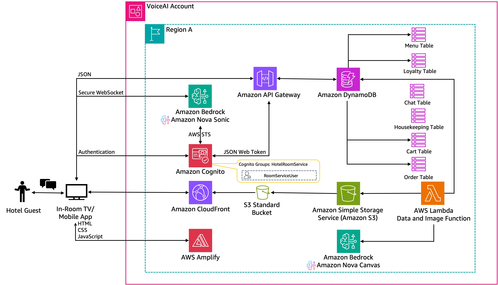
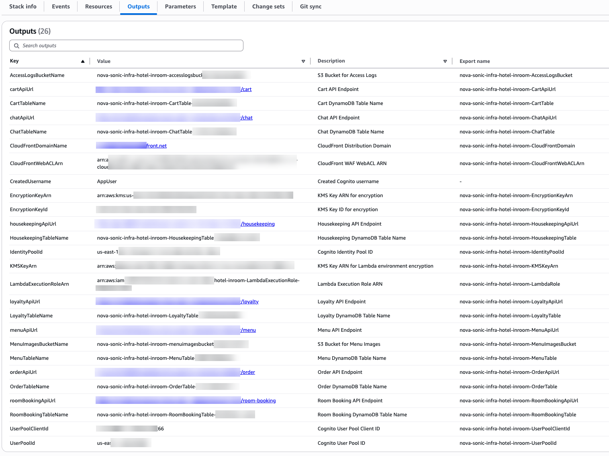

# Voice AI-Powered Hotel In-Room Service with Amazon Nova Sonic

## Table of Contents
- 📋 [Overview](#overview)
- 🏗️ [Solution overview](#solution-overview)
- ✅ [Prerequisites](#prerequisites)
- 🚀 [Deploy solution resources using AWS CloudFormation](#deploy-solution-resources-using-aws-cloudformation)
- ☁️ [AWS services in this solution](#aws-services-in-this-solution)
- 💰 [Cost](#cost)
- 🔒 [Security](#security)
- 🧹 [Clean up](#clean-up)
- 💡 [Considerations](#considerations)
- 📝 [Conclusion](#conclusion)
- 📚 [Additional resources](#additional-resources)
- 📋 [Revisions](#revisions)
- ⚠️ [Notices](#notices)
- 👥 [Authors](#authors)
- 📜 [License](#license)

## Overview

The hospitality industry faces significant challenges in delivering consistent, high-quality in-room service experiences. Traditional room service systems often struggle with language barriers, staffing limitations during peak hours, order accuracy issues, and inconsistent service quality across different shifts. These challenges, combined with rising operational costs and evolving guest expectations, have pushed hotels to seek innovative solutions that enhance guest satisfaction while optimizing operational efficiency.

Modern hotel guests expect seamless, personalized service experiences similar to what they encounter with digital platforms. Voice AI technology presents an unprecedented opportunity to provide 24/7 availability, consistent service quality, and natural language interactions that can handle complex requests across multiple languages and accents.

Amazon Nova Sonic is a foundation model (FM) within the Amazon Nova family, designed specifically for voice-enabled applications. Available through Amazon Bedrock, developers can use Nova Sonic to create applications that understand spoken language, process complex conversational interactions, and generate appropriate responses for real-time guest engagement. This innovative speech-to-speech model addresses traditional voice application challenges through:

- Accurately recognizes streaming speech across accents with robustness to background noise
- Adapts speech response to user's tone and sentiment
- Bidirectional streaming speech I/O with low user perceived latency
- Graceful interruption handling and natural turn-taking in conversations
- Industry-leading price-performance

When integrated with AWS serverless services, Nova Sonic delivers natural, human-like voice interactions that transform the in-room service experience. The architecture creates a cost-effective system that enhances both guest satisfaction and operational efficiency through intelligent automation.

In this solution, we explore an innovative hotel in-room service system that uses Amazon Nova Sonic to create a conversational interface for room service ordering, housekeeping requests, and concierge services. This approach modernizes guest services while preserving the personal touch that defines exceptional hospitality.

## Solution overview

Our voice AI hotel in-room service solution creates an intelligent guest service system that combines real-time voice interaction with a robust backend infrastructure, delivering a natural and personalized guest experience. The system processes speech in real-time, understanding various accents, speaking styles, and handling background noise common in hotel environments. The integration of voice commands with interactive digital displays enhances user feedback while streamlining service requests.

The system is built on AWS serverless architecture, integrating key components including Amazon Cognito for authentication with role-based access control, AWS Amplify for the digital service interface, Amazon API Gateway to facilitate access to Amazon DynamoDB tables, AWS Lambda functions with Amazon Nova Canvas for service image generation, and Amazon Simple Storage Service (Amazon S3) with Amazon CloudFront for image storage and delivery.

The architecture combines several AWS services to transform natural language requests into actionable service orders for hotel operations. Guests can interact with room service using everyday language, automatically generating and processing appropriate service requests. Amazon Nova Sonic serves as the intelligent layer that maintains context throughout the conversation, handles request refinements, and facilitates accurate service delivery.

Key features of the solution include:

* Secure guest authentication through Amazon Cognito with role-based access control
* Digital service interface hosted on AWS Amplify
* Real-time request processing and confirmation
* Natural language to structured service request transformation
* Context-aware conversation management
* Multi-service support (room service, housekeeping, concierge)

*Figure 1. Reference Architecture of Voice AI Powered Hotel In-Room Service Platform*

The workflow consists of the following steps:

1. Guests interact with an in-room digital interface built using modern web technologies, hosted on Amplify.
2. Authentication is handled through Amazon Cognito, which verifies guest identities and provides secure access credentials.
3. After authentication, guests can make natural language service requests through the voice interface.
4. Amazon Nova Sonic processes these requests and transforms them into structured service orders.
5. Lambda functions, operating with the necessary IAM roles, process the service requests and update the appropriate DynamoDB tables.
6. Hotel staff receive notifications and can track service requests through the management interface.
7. The system provides real-time updates to guests about their service request status.

This architecture provides secure, efficient request processing while maintaining a simple, conversation-like experience for guests. The system scales automatically and maintains security through role-based access controls and secure credential management.

## Prerequisites

You must have the following in place to complete the solution in this post:

* An [AWS account](https://signin.aws.amazon.com/signin?redirect_uri=https%3A%2F%2Fportal.aws.amazon.com%2Fbilling%2Fsignup%2Fresume&amp;client_id=signup)
* FM [access](https://docs.aws.amazon.com/bedrock/latest/userguide/model-access.html) in Amazon Bedrock for Amazon Nova Sonic and Amazon Nova Canvas in the same [AWS Region](https://docs.aws.amazon.com/glossary/latest/reference/glos-chap.html#region) where you will deploy this solution
* The accompanying [AWS CloudFormation](http://aws.amazon.com/cloudformation) templates downloaded from the [aws-samples GitHub repo](https://github.com/aws-samples/sample-voice-ai-powered-in-room-service-with-amazon-nova-sonic)

## Deploy solution resources using AWS CloudFormation

Deploy the CloudFormation templates in an AWS Region where Amazon Bedrock is available and has support for the following models: Amazon Nova Sonic and Amazon Nova Canvas.

This solution consists of two CloudFormation templates that work together to create a complete hotel in-room service system. 
- The `nova-sonic-infrastructure-hotel-InRoomService.yaml` template establishes the foundational AWS infrastructure including Cognito user authentication, S3 storage with CloudFront CDN for service images, DynamoDB tables for menu items and service requests, and API Gateway endpoints with proper CORS configuration.
- The `nova-sonic-application-hotel-InRoomService.yaml` template builds upon this foundation by deploying Lambda functions that populate the system with a complete embedded hotel service menu featuring room service items, housekeeping options, and concierge services, while using the Amazon Nova Canvas AI model to automatically generate professional service imagery and storing them in the S3 bucket for delivery through CloudFront.

### Deploy Infrastructure Stack

During the deployment of the first CloudFormation template `nova-sonic-infrastructure-hotel-InRoomService.yaml`, you will need to specify the following parameters:

* Stack name
* Environment - Deployment environment: dev, staging, or prod (defaults to dev)
* UserEmail - Valid email address for the guest account (required)

**Important**: You must enable access to the selected Amazon Nova Sonic model and Amazon Nova Canvas model in the Amazon Bedrock console before deployment.

AWS resource usage will incur costs. When deployment is complete, the following resources will be deployed:

* **Amazon Cognito resources:**
  * User pool – CognitoUserPool
  * App client – AppClient
  * Identity pool – CognitoIdentityPool
  * Groups – AppUserGroup
  * User – AppUser

* **AWS Identity and Access Management (IAM) resources:**
  * IAM roles:
    * AuthenticatedRole
    * DefaultAuthenticatedRole
    * ApiGatewayDynamoDBRole
    * LambdaExecutionRole
    * S3BucketCleanupRole

* **Amazon DynamoDB tables:**
  * MenuTable – Stores room service menu items, pricing, and customization options
  * HousekeepingTable – Stores housekeeping and concierge service requests
  * RoombookingTable – Stores guest information and preferences
  * OrderTable – Stores completed and pending room service orders
  * ChatTable – Stores conversation history for service interactions
  * CartTable – Stores real-time cart information for each user

* **Amazon S3, CloudFront and AWS WAF resources:**
  * o	MenuImagesBucket – S3 bucket for storing menu item images
  * MenuImageCloudFrontDistribution - CloudFront distribution for global content delivery
  * CloudFrontOriginAccessIdentity – Secure access between CloudFront and S3
  * CloudFrontWebACL – WAF protection for CloudFront distribution with security rules

* **Amazon API Gateway resources:**
  * REST API – hotel-service-api with Cognito authorization
  * API resources and methods:
    * /menu (GET, OPTIONS)
    * /housekeeping (GET, POST, OPTIONS)
    * /loyalty (GET, POST, OPTIONS)
    * /order (POST, GET, OPTIONS)
    * /chat (POST, OPTIONS)
    * /cart (POST, OPTIONS)
  * API deployment to specified environment stage

* **AWS Lambda function:**
  * S3BucketCleanupLambda – Cleans up S3 bucket on stack deletion

* **CloudFormation Custom Resource:**
  * S3BucketCleanup – Triggers S3BucketCleanupLambda

After you deploy the CloudFormation template, copy the following from the Outputs tab on the AWS CloudFormation console to use during the configuration of your frontend application:

* menuApiUrl
* housekeepingApiUrl
* orderApiUrl
* chatApiUrl
* cartApiUrl
* UserPoolClientId
* UserPoolId
* IdentityPoolId

*Figure 2. Output of infrastructure deployment template*

These output values are essential for configuring your frontend application (deployed via AWS Amplify) to connect with the backend services. The API URLs will be used for making REST API calls, while the Cognito IDs will be used for guest authentication and authorization.

### Deploy Application Stack

During the deployment of the second CloudFormation template `nova-sonic-application-hotel-InRoomService.yaml` you will need to specify the following parameters:

* Stack name
* InfrastructureStackName – This stack name matches the one you previously deployed using `nova-sonic-infrastructure-hotel-InRoomService.yaml`

When deployment is complete, the following resources will be deployed:

* **AWS Lambda function:**
  * HotelMenuLambda – Populates service menu data and generates AI images

* **CloudFormation Custom Resource:**
  * HotelMenuPopulation – Triggers HotelMenuLambda

Once both CloudFormation templates are successfully deployed, you'll have a fully functional hotel in-room service system with AI-generated service images, complete authentication, and ready-to-use API endpoints for your Amplify frontend deployment.

## Deploy the Amplify application

You need to manually deploy the Amplify application using the frontend code found on GitHub. Complete the following steps:

1. Download the frontend code `frontend-hotel-inroom-service.zip` from GitHub.
2. Use the .zip file to manually [deploy](deploy/frontend-hotel-inroom-service.zip) the application in Amplify.
3. Return to the Amplify page and use the domain it automatically generated to access the application.

## User authentication

The solution uses Amazon Cognito user pools and identity pools to implement secure, role-based access control for the hotel's in-room service system. User pools handle authentication and group management through the AppUserGroup, and identity pools provide temporary AWS credentials mapped to specific IAM roles including AuthenticatedRole. The system ensures that only verified guests can access the application and interact with the service APIs, room service ordering, housekeeping requests, and concierge services, while also providing secure access to Amazon Bedrock. This combines robust security with an intuitive service experience for both guests and hotel operations.

## Serverless data management

The solution implements a serverless API architecture using Amazon API Gateway to create a single REST API (hotel-service-api) that facilitates communication between the frontend interface and backend services. The API includes five resource endpoints (/menu, /housekeeping, /concierge, /order, /chat) with Cognito-based authentication and direct DynamoDB integration for data operations. The backend utilizes five DynamoDB tables: MenuTable for room service items and pricing, ServiceRequestTable for housekeeping and concierge requests, GuestTable for guest profiles and preferences, OrderTable for order tracking and history, and ChatTable for capturing conversation history. This architecture provides fast, consistent performance at scale with Global Secondary Indexes enabling efficient queries by guest ID and request status for optimal hotel operations.

## Service menu and image generation

The solution uses Amazon S3 and CloudFront for secure, global content delivery of service item images. The CloudFormation template creates a ServiceImagesBucket with restricted access through a CloudFront Origin Access Identity, ensuring images are served securely using the CloudFront distribution for fast loading times worldwide. AWS Lambda powers the AI-driven content generation through the HotelMenuLambda function, which automatically populates sample service data and generates high-quality service item images using Amazon Nova Canvas. This serverless function executes during stack deployment to create professional imagery for service items, from gourmet room service meals to housekeeping amenities, facilitating consistent visual presentation across the entire service catalog. The Lambda function integrates with DynamoDB to store generated image URLs and uses S3 for persistent storage, creating a complete automated workflow that scales based on demand while optimizing costs through pay-per-use pricing.

## Voice AI processing

The solution uses Amazon Nova Sonic as the core voice AI engine. The in-room service interface establishes direct integration with Amazon Nova Sonic through secure WebSocket connections, enabling immediate processing of guest speech input and conversion to structured service requests. The CloudFormation template configures IAM permissions for the AuthenticatedRole to access the amazon.nova-sonic-v1:0 foundation model, allowing authenticated guests to interact with the voice AI service. Nova Sonic handles complex natural language understanding and intent recognition, processing guest requests like menu inquiries, service modifications, and special accommodations while maintaining conversation context throughout the service interaction. This direct integration minimizes latency concerns and provides guests with a natural, conversational service experience that rivals human interaction while maintaining reliable service across hotel locations.

## Hosting the in-room service interface

AWS Amplify hosts and delivers the in-room service interface as a scalable frontend application. The interface displays AI-generated service images through CloudFront, with real-time pricing and availability from DynamoDB, optimized for in-room tablet environments. The React-based application automatically scales during peak hours, using the global content delivery network available in CloudFront for fast loading times. It integrates with Amazon Cognito for authentication, establishes WebSocket connections to Amazon Nova Sonic for voice processing, and uses API Gateway endpoints for service and order management. This serverless solution maintains high availability while providing real-time visual updates as guests interact through voice commands.

## AWS services in this solution

| AWS service | Description |
|-------------|-------------|
| [Amazon Nova Sonic](https://aws.amazon.com/ai/generative-ai/nova/) | Core. AWS's foundation model for voice-enabled applications with speech-to-speech capabilities. |
| [Amazon Nova Canvas](https://aws.amazon.com/ai/generative-ai/nova/creative/) | Core. AWS's foundation model for generating high-quality service item images. |
| [Amazon Bedrock](https://aws.amazon.com/bedrock/) | Core. Provides access to Amazon Nova models for voice processing and image generation. |
| [AWS Lambda](https://aws.amazon.com/lambda/) | Core. Executes serverless functions for service processing and menu population. |
| [Amazon DynamoDB](https://aws.amazon.com/dynamodb/) | Core. Stores service menus, guest data, orders, and conversation history. |
| [Amazon S3](https://aws.amazon.com/s3/) | Core. Stores AI-generated service images and static assets. |
| [Amazon CloudFront](https://aws.amazon.com/cloudfront/) | Core. Global content delivery network for fast image and asset delivery. |
| [Amazon API Gateway](https://aws.amazon.com/api-gateway/) | Core. REST API for frontend-backend communication with Cognito authorization. |
| [Amazon Cognito](https://aws.amazon.com/cognito/) | Core. Provides guest authentication and authorization for the service interface. |
| [AWS Amplify](https://aws.amazon.com/amplify/) | Core. Hosts the frontend web application for the in-room service interface. |
| [AWS Identity and Access Management (IAM)](https://aws.amazon.com/iam/) | Supporting. Manages permissions and access control for AWS services used in the solution. |
| [AWS CloudFormation](http://aws.amazon.com/cloudformation) | Supporting. Deploys and configures the solution resources in a consistent and repeatable manner. |

## Cost

This estimate assumes moderate usage patterns with typical hotel service workloads. The majority of the cost comes from Amazon Bedrock usage for voice processing and image generation. Costs could increase with:

* Higher guest interaction frequency and complexity
* Larger service catalogs requiring more AI-generated images
* Increased token usage for complex natural language interactions
* Additional data storage and transfer

| AWS Service | Usage Estimate | Monthly Cost (USD) |
|-------------|----------------|---------------------|
| Amazon Bedrock (Nova Sonic) | 2,000 voice interactions * 30 seconds avg. | $45.00 |
| Amazon Bedrock (Nova Canvas) | 500 image generations | $25.00 |
| Amazon DynamoDB | 10GB storage, 50,000 read/write units | $15.00 |
| Amazon S3 | 50GB storage, 5GB data transfer | $3.75 |
| Amazon CloudFront | 100GB data transfer, 1M requests | $8.50 |
| AWS Lambda | 10,000 invocations * 5 functions * 3s avg. duration | $0.00 (within free tier) |
| Amazon API Gateway | 100,000 API calls | $0.35 |
| Amazon Cognito | 1,000 MAU | $0.00 (within free tier) |
| AWS Amplify | 5GB storage, 15GB data transfer | $0.75 |
| Amazon CloudWatch | Basic monitoring + 2 GB logs | $1.00 |
| **Total Estimated Monthly Cost** | | **$99.35** |

## Security

When you build systems on AWS infrastructure, security responsibilities are shared between you and AWS. This [shared responsibility model](https://aws.amazon.com/compliance/shared-responsibility-model/) reduces your operational burden because AWS operates, manages, and controls the components including the host operating system, the virtualization layer, and the physical security of the facilities in which the services operate. For more information about AWS security, visit [AWS Cloud Security](http://aws.amazon.com/security/).

This solution implements the following security features:

- **Amazon Cognito guest authentication** - Secure guest authentication with user pools and identity pools
- **Role-based access control** - Ensures that only authorized guests can access specific services and functionality
- **IAM roles and policies** - Provides least-privilege permissions for Lambda functions and other AWS services
- **Secure API communication** - All communication between components uses HTTPS encryption
- **WAF protection** - CloudFront distribution protected by AWS WAF with security rules

## Clean up

If you decide to discontinue using the solution, you can follow these steps to remove it, its associated resources deployed using AWS CloudFormation, and the Amplify deployment:

1. **Delete the CloudFormation stacks:**
   * On the AWS CloudFormation console, choose Stacks in the navigation pane.
   * Locate the application stack you created during the deployment process of `nova-sonic-application-hotel-InRoomService.yaml` (you assigned a name to it).
   * Select the stack and choose Delete.
   * Repeat this for the infrastructure stack `nova-sonic-infrastructure-hotel-InRoomService.yaml` deployment.

2. **Delete the Amplify application and its resources.** For instructions, refer to [Clean Up Resources](https://aws.amazon.com/getting-started/hands-on/build-web-app-s3-lambda-api-gateway-dynamodb/module-six/).

## Considerations

For optimal guest experience across your hotel properties, deploy this Amazon Nova Sonic-powered in-room service solution with proper network connectivity and device management. This integration demonstrates how Amazon Bedrock can execute complex service requests through voice interactions, providing conversational access to hotel services while maintaining comprehensive guest privacy and data protection.

Before deploying to production, enhance security by implementing additional safeguards. You can do this by associating [guardrails](https://docs.aws.amazon.com/bedrock/latest/userguide/agents-guardrail.html) with your voice AI service in [Amazon Bedrock Guardrails](https://aws.amazon.com/bedrock/guardrails/).

Consider implementing the following enhancements for production deployment:
- Integration with hotel property management systems (PMS)
- Multi-language support for international guests
- Accessibility features for guests with disabilities
- Staff notification systems for service requests
- Analytics and reporting for service optimization

## Conclusion

The voice AI-powered hotel in-room service system using Amazon Nova Sonic provides hotels with a practical solution to common operational challenges including staffing constraints, service consistency issues, and guest satisfaction concerns. The serverless architecture built on AWS services—Amazon Cognito for authentication, API Gateway for data communication, DynamoDB for storage, and AWS Amplify for hosting—creates a scalable system that handles varying demand while maintaining consistent performance.

The system supports essential hotel operations including room service ordering, housekeeping requests, concierge services, and guest communication through direct API Gateway and DynamoDB integration. For hotels looking to modernize their guest services, this solution offers measurable benefits including improved guest satisfaction, reduced response times, and operational efficiency gains. The pay-per-use pricing model and automated scaling help control costs while supporting business growth.

As guest expectations shift toward more personalized and efficient service experiences, implementing voice AI technology provides hotels with a competitive advantage and positions them well for future technological developments in the hospitality industry.

## Additional resources

To learn more about the technologies used in this solution, refer to the following resources:

* [Amazon Nova Foundation Models](https://aws.amazon.com/ai/generative-ai/nova/)
* [Amazon Bedrock User Guide](https://docs.aws.amazon.com/bedrock/latest/userguide/)
* [Introducing Amazon Nova Sonic: Human-like voice conversations for generative AI applications](https://aws.amazon.com/blogs/aws/introducing-amazon-nova-sonic-human-like-voice-conversations-for-generative-ai-applications/)
* [AWS Amplify User Guide](https://docs.aws.amazon.com/amplify/)
* [Amazon Cognito Developer Guide](https://docs.aws.amazon.com/cognito/)

## Revisions

- **v1.0.0** – Initial release with Amazon Nova Sonic integration for hotel in-room service

## Notices

Customers are responsible for making their own independent assessment of the information in this solution.

This solution:
(a) is for informational purposes only,
(b) represents AWS current product offerings and practices, which are subject to change without notice, and
(c) does not create any commitments or assurances from AWS and its affiliates, suppliers, or licensors.

AWS products or services are provided "as is" without warranties, representations, or conditions of any kind, whether express or implied.
AWS responsibilities and liabilities to its customers are controlled by AWS agreements, and this solution is not part of, nor does it modify, any agreement between AWS and its customers.

## Authors
- Ravi Kumar, Sr. TAM
- Salman Ahmed, Sr. TAM
- Sergio Barraza, Sr. TAM
- Ankush Goyal, Sr. TAM

## License

This library is licensed under the MIT-0 License. See the [LICENSE](./LICENSE) file.
